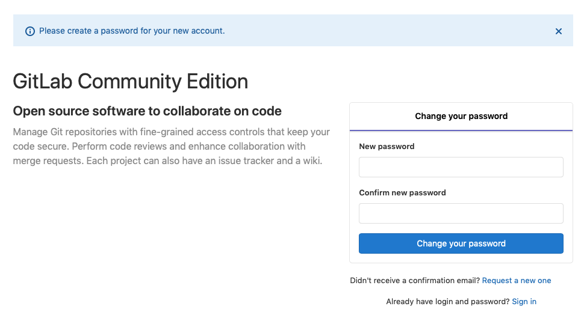

# Simple gitlab-ce on a single EC2 instance


### Requirements
- EC2 Key pair (ssh key)
- AWS HostedZone and 1 TLD

### 1. Clone repo
    git clone https://github.com/ventx/terraform-gitlabce-ec2.git
    cd terraform-gitlabce-ec2
### 2. Edit variables.tf
- this is your hostedzone tld like `example.com`
```
variable "domain" {
  description = "gitlab server TLD"
}
```
- this is the subdomain for the giltab-ce instance like `gitlab.example.com`
```
variable "subdomain" {
  description = "Subdomain"
}
```
- this is your hostedzone tld like `example.com`
### Rest of the variables are for your aws account informations like vpc, subnet and ssh key
### 3. Deploy the instance
    terraform init
    terraform plan
    terraform apply
Connect to the instance
- `ssh ubuntu@aws_instance.gitlabce.public_ip -i ssh_key.pem.txt`

open log file from the installation
- `tail -f /var/log/cloud-init-output.log`

wait for the setup to be completed. Visit your gitlab-ce instance unter https://gitlab.example.com 
- `${var.subdomain}.${data.aws_route53_zone.hostedzone.name}`]
 create your admin password on the first visit
 

# Version history
- 1.0

### Terraform Readme
## Providers

| Name | Version |
|------|---------|
| aws | n/a |
| template | n/a |

## Inputs

| Name | Description | Type | Default | Required |
|------|-------------|------|---------|:-----:|
| ami | AMI to be used, default is Ubuntu 18.67 Bionic | `string` | `"ami-090f10efc254eaf55"` | yes |
| domain | gitlab server TLD | `string` | `""` | yes |
| instancename | EC2 instance name | `string` | `"gitlabce"` | yes |
| instancetype | EC2 instance type | `string` | `"t3.medium"` | yes |
| keyname | SSH key name | `string` | `""` | yes |
| owner | Owner Tag for AWS console | `string` | `""` | yes |
| profile | AWS Profile | `string` | `"default"` | yes |
| region | AWS Region | `string` | `"eu-central-1"` | yes |
| subdomain | Subdomain | `string` | `"gitlab"` | yes |
| subnetid | Subnet for the Gitlab Instance | `string` | `""` | yes |
| vpc | AWS VPC | `string` | `""` | yes |

## Outputs

| Name | Description |
|------|-------------|
| instancename | Instance Name |
| instancetype | Instance Type |
| keyname | Instance SSH Keyname |
| privateip | Instance Private IPv4 |
| publicip | Instance Pupblic IPv4 |
| userdata | Userdata for gitlabce Setup |

